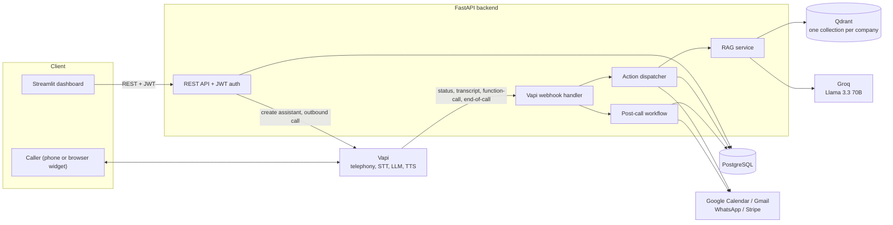
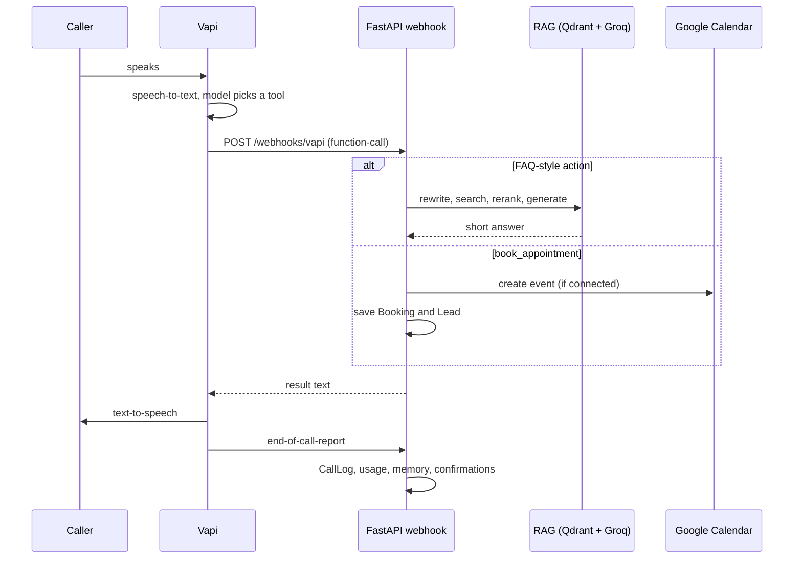

# AI Voice Agent Platform


<!-- Add the CI badge once the first workflow run is green:
[](https://github.com/Ismailshah-123/Multi_voice_agent/actions) -->

A multi-tenant platform for building and operating AI phone agents. A business picks an industry template (or describes itself in plain English), uploads its own documents, and deploys a voice agent that answers calls, books appointments, takes orders, and logs every conversation as a CRM lead.

The voice pipeline itself (telephony, speech-to-text, text-to-speech) is delegated to [Vapi](https://vapi.ai). This repository is everything around it: the agent builder, the webhook backend that executes the agent's tool calls, a per-tenant RAG knowledge base, post-call automation, outbound campaigns, billing, and a Streamlit dashboard.

## Overview

| | |
|---|---|
| **Backend** | FastAPI, SQLAlchemy 2, Alembic, PostgreSQL |
| **Frontend** | Streamlit (landing page, auth, 10 dashboard pages) |
| **Voice engine** | Vapi assistant: Deepgram transcriber, ElevenLabs voice, Groq `llama-3.3-70b-versatile` as the model |
| **Retrieval** | Qdrant, local `BAAI/bge-small-en-v1.5` embeddings, BM25 + Reciprocal Rank Fusion, local cross-encoder reranker |
| **Size** | ~10k lines of Python, 19 database tables, 17 route modules, 36 pytest tests |

## The problem

Small and mid-sized businesses miss calls: staff are busy, hold times are long, and after-hours calls go to voicemail. Building a voice agent that is useful (not just a demo) means more than wiring speech-to-text to an LLM. It needs grounding in the business's own documents, real actions (calendar, orders, leads), a follow-up step after the call, and isolation between customers.

## The solution

Each company gets its own agents, knowledge base and CRM data. An agent is created from a template, deployed to Vapi with a set of tool schemas, and from then on Vapi calls back into this backend whenever the model decides to act. The backend executes the action, answers from the company's documents when asked a question, and records what happened.

## Key features

| Area | What it does | Status |
|---|---|---|
| **Agent builder** | 11 data-driven industry templates, or a "custom" mode where Groq generates the prompt, greeting and suggested actions from a business description. Deploys a Vapi assistant with tool schemas. | Implemented |
| **Tool calling** | About two dozen predefined tool schemas (booking, cancelling, orders, lead capture, FAQ, caller history) with keyword-based fallback for unknown action names. Optional human handoff when an escalation number is set. | Implemented |
| **Knowledge base (RAG)** | Upload PDF, DOCX, CSV, XLSX, TXT or images (OCR via Tesseract). Retrieval: query rewriting, semantic cache, hybrid search, reranking, grounded answer. | Implemented |
| **Appointments** | Creates a Google Calendar event, stores the event ID so the call can later be cancelled, and saves a Booking and Lead. | Implemented; requires Google OAuth credentials |
| **Post-call workflow** | Saves transcript, summary, recording URL and cost; links the lead; updates a per-caller memory profile; sends WhatsApp and Gmail confirmations. | Implemented; messaging requires credentials |
| **Live calls** | Active calls with streaming transcript, a keyword-based frustration flag, and "Listen Live" audio in the browser. | Implemented (polling every 3 s) |
| **Outbound campaigns** | CSV import, calling-hours window, do-not-call filtering, automatic opt-out detection during calls, pause. | Implemented |
| **Prompt A/B testing** | Each variant is deployed as its own Vapi assistant; calls and conversions are counted from end-of-call summaries. | Partial: conversions are inferred from summary keywords |
| **Knowledge gaps** | Questions the RAG pipeline could not answer are grouped by meaning and counted. | Partial: logs retrieval misses only, not answers the LLM itself declines |
| **Teams** | Invite existing users to a company with an owner, admin or staff role. | Partial: roles are stored but not enforced |
| **Billing** | Stripe Checkout, customer portal, webhook handling, invoice records and PDF receipts. Usage minutes are counted per company. | Partial: not verified against a live Stripe account; plan limits are stored but not enforced |
| **Analytics and admin** | KPI cards, calls-per-day and outcome charts; a platform-wide admin page. | Implemented |

## System architecture



## How it works

**1. Deploying an agent.** `POST /api/v1/agents` checks that the caller belongs to the company, builds the system prompt (from a template or via Groq for custom agents), saves an `Agent` row, generates the tool schemas for the enabled actions, and creates a Vapi assistant whose server URL points at `PUBLIC_BASE_URL/api/v1/webhooks/vapi`. If Vapi rejects the request, the agent is marked `failed` and the Vapi error is returned.

**2. During a call.** Vapi runs the conversation. When the model decides to act, Vapi posts a `function-call` event to the webhook. `execute_action` routes it to a handler (book, cancel, order, lead, FAQ, caller history) and the returned text is spoken back to the caller. `transcript` events feed the live-call view and the sentiment and opt-out heuristics.



**3. After the call.** The `end-of-call-report` event creates the `CallLog`, updates the campaign contact if the call was outbound, adds to the company's minute counter, then runs the post-call workflow: link the lead created during the call, extract structured facts about the caller with Groq and merge them into a `CustomerProfile`, and send WhatsApp and email confirmations if configured. Failures in that last step are logged and never affect the call record.

**4. Knowledge ingestion and retrieval.**

```
Upload -> parse text -> chunk (220 words, 40 overlap) -> embed (bge-small-en-v1.5, 384-d)
       -> Qdrant collection kb_{company_id}

Question -> rewrite follow-ups using call context (Groq)
         -> semantic cache (cosine >= 0.93, in-process)
         -> vector search + BM25, fused with Reciprocal Rank Fusion
         -> cross-encoder rerank (ms-marco-MiniLM-L-6-v2)
         -> confidence cutoff -> grounded answer (Groq, max 150 tokens)
```

Tenant isolation for knowledge is structural: each company's vectors live in a separate Qdrant collection, so a query cannot reach another company's chunks.

## Technology stack

| Layer | Technology |
|---|---|
| API | FastAPI 0.115, Pydantic 2, uvicorn |
| Data | PostgreSQL, SQLAlchemy 2, Alembic |
| Auth | JWT (HS256, 24 h) via python-jose, bcrypt via passlib |
| Voice | Vapi (Deepgram STT, ElevenLabs TTS, Vapi web widget) |
| LLM | Groq: `llama-3.3-70b-versatile` for call model, prompt generation, query rewriting, RAG answers, memory extraction, preview chat |
| Retrieval | Qdrant, sentence-transformers (`BAAI/bge-small-en-v1.5`, `cross-encoder/ms-marco-MiniLM-L-6-v2`), rank-bm25 |
| Documents | pypdf, python-docx, openpyxl, pytesseract |
| Integrations | Google Calendar and Gmail, Microsoft Graph (OAuth only), WhatsApp Cloud API, Stripe |
| Frontend | Streamlit, Plotly, Chart.js widgets |
| Tests / CI | pytest, GitHub Actions |

## Project structure

```
.
├── backend/
│   ├── app/
│   │   ├── api/routes/     # 17 route modules (auth, agents, webhooks, knowledge base, billing, campaigns, ...)
│   │   ├── core/           # settings, DB session, JWT and password hashing
│   │   ├── models/         # 19 SQLAlchemy tables
│   │   ├── schemas/        # Pydantic request/response models
│   │   ├── services/       # Vapi client, RAG pipeline, action handler, post-call workflow, billing, integrations
│   │   ├── templates/      # industry templates (data, not code)
│   │   └── main.py         # app wiring, CORS, startup seeding
│   ├── alembic/            # schema migrations
│   ├── scripts/            # create_stripe_plans.py
│   └── tests/
├── frontend/               # app.py (landing + auth), pages/1..10, utils/
├── scripts/git_push.py     # commit-and-push helper that keeps secrets out of git
└── .github/workflows/ci.yml
```

## Prerequisites

- Python 3.10+
- PostgreSQL (the models use native UUID columns; SQLite is not supported at runtime)
- A [Vapi](https://vapi.ai) account: private API key and public key
- A [Groq](https://console.groq.com) API key
- Optional: Tesseract (image OCR), a Qdrant server (otherwise local on-disk storage is used), and OAuth or API credentials for Google, Microsoft, WhatsApp and Stripe

## Installation

```bash
git clone https://github.com/Ismailshah-123/Multi_voice_agent.git
cd Multi_voice_agent

# Backend
cd backend
python -m venv .venv
source .venv/bin/activate          # Windows: .venv\Scripts\activate
pip install -r requirements.txt
cp .env.example .env               # then fill it in (see below)

# Frontend
cd ../frontend
python -m venv .venv
source .venv/bin/activate
pip install -r requirements.txt
```

A local PostgreSQL for development:

```bash
docker run --name voiceagent-db -e POSTGRES_PASSWORD=password -e POSTGRES_DB=voiceagent -p 5432:5432 -d postgres:16
```

## Environment variables

Configured in `backend/.env` (see `backend/.env.example`). Settings are validated at startup by `app/core/config.py`.

| Variable | Required | Purpose |
|---|---|---|
| `DATABASE_URL` | Yes | PostgreSQL connection string |
| `JWT_SECRET_KEY` | Yes | Token signing key. In production it must be at least 32 characters |
| `VAPI_API_KEY` | Yes | Vapi private key, used to create assistants, numbers and calls |
| `PUBLIC_BASE_URL` | For calls | Public URL of this backend; Vapi posts webhooks to `<url>/api/v1/webhooks/vapi` |
| `VAPI_PUBLIC_KEY` | For the browser widget | Public Vapi key served to the web-call widget |
| `VAPI_WEBHOOK_SECRET` | Production | Shared secret checked on every webhook (`x-vapi-secret`) |
| `VAPI_OUTBOUND_PHONE_NUMBER_ID` | Campaigns | Vapi number outbound calls are placed from |
| `GROQ_API_KEY` | Recommended | Custom prompts, RAG answers, query rewriting, memory extraction, preview chat |
| `QDRANT_URL`, `QDRANT_API_KEY` | Optional | If empty, Qdrant runs on disk in `./qdrant_data` (single process only) |
| `GOOGLE_*`, `MICROSOFT_*` | Optional | OAuth apps for calendar and mail |
| `WHATSAPP_TOKEN`, `WHATSAPP_PHONE_NUMBER_ID` | Optional | WhatsApp Cloud API confirmations |
| `STRIPE_SECRET_KEY`, `STRIPE_WEBHOOK_SECRET` | Optional | Billing |
| `ALLOWED_ORIGINS` | Yes | Comma-separated CORS origins (default allows the local Streamlit app) |
| `ENVIRONMENT` | No | `development` (default) or `production`, which enables stricter startup checks |

`REDIS_URL`, `OPENAI_API_KEY`, `TWILIO_ACCOUNT_SID` and `TWILIO_AUTH_TOKEN` exist in the settings but are not used by the current code.

The frontend reads `BACKEND_URL` from `frontend/.streamlit/secrets.toml` and defaults to `http://localhost:8000`.

## Running locally

```bash
# 1. Backend (from backend/)
alembic upgrade head
uvicorn app.main:app --reload --port 8000
# API docs: http://localhost:8000/docs (disabled when ENVIRONMENT=production)

# 2. Frontend (from frontend/)
streamlit run app.py
# http://localhost:8501
```

Vapi has to reach the webhook, so for live calls during development expose the backend through a tunnel and set `PUBLIC_BASE_URL` to that address. The first knowledge-base upload downloads the embedding model (about 130 MB); the reranker model downloads on first query.

To use the admin page, mark a user as platform owner directly in the database (nothing in the app sets this flag): `UPDATE users SET is_superadmin = true WHERE email = '...';`

## API overview

Interactive docs at `/docs`. Route groups under `/api/v1`:

| Prefix | Purpose |
|---|---|
| `/auth` | signup, login |
| `/companies` | tenants, team invites and members, escalation number |
| `/agents` | create and deploy, list, delete, text preview chat |
| `/knowledge-base`, `/knowledge-gaps` | upload, list, delete, retrieval test; unanswered questions |
| `/webhooks/vapi` | Vapi events: status, transcript, function-call, end-of-call |
| `/live-calls`, `/vapi-widget` | active calls; browser call widget |
| `/campaigns`, `/leads` | outbound campaigns and do-not-call list; leads and CSV export |
| `/ab-tests` | prompt variants per agent |
| `/integrations` | Google and Microsoft OAuth |
| `/billing` | plans, checkout, portal, invoices, Stripe webhook |
| `/analytics`, `/onboarding`, `/admin`, `/demo` | dashboard data, setup checklist, platform admin, public demo chat |

## Frontend

| Page | Purpose |
|---|---|
| `app.py` | Landing page, live demo chat, missed-call cost estimator, login and signup |
| 1 Dashboard | Companies, agents, onboarding checklist, escalation number, A/B variants, preview chat |
| 2 Create Agent | Industry or custom agent, language, deploy |
| 3 Knowledge Base | Upload and manage documents, test retrieval, connect Google or Microsoft, knowledge gaps |
| 4 Billing | Plans, checkout, billing portal, invoices |
| 5 Leads | Captured leads, CSV export |
| 6 Analytics | KPIs and charts |
| 7 Live Calls | In-progress calls, transcript, Listen Live |
| 8 Campaigns | Outbound campaigns, do-not-call list |
| 9 Team | Invite members |
| 10 Admin | Platform-wide overview (superadmin only) |

The frontend talks to the backend only through `frontend/utils/api_client.py`, which attaches the JWT and clears the session on a 401.

## Example workflow

1. Sign up, create a company, and open **Create Agent**.
2. Choose an industry (or "custom" and describe the business), pick a language, deploy.
3. Upload a menu, price list or policy document in **Knowledge Base** and test a question.
4. Connect Google Calendar so bookings become real calendar events.
5. Call the agent (Vapi phone number or the browser widget). Watch it in **Live Calls**.
6. Review the call, the lead it created, and the analytics afterwards.

## Screenshots

_Placeholder: no screenshots are committed yet. Add images under `docs/screenshots/` (dashboard, agent builder, live calls, analytics) and reference them here._

## Testing

```bash
cd backend
pytest
```

36 tests, all passing, cover authentication, the prompt builder, action schemas, sentiment and opt-out heuristics, RAG chunking, campaign compliance, admin and webhook security, onboarding and teams, and a migration test that builds a fresh database from the Alembic migrations and fails if it differs from the SQLAlchemy models. None of them need the embedding or reranker models downloaded. CI (`.github/workflows/ci.yml`) compiles both apps and runs the backend tests.

## Security

Implemented:

- Passwords hashed with bcrypt; JWT access tokens (HS256, 24 h expiry).
- Every authenticated route that touches company data resolves the company (or the resource's company) through an ownership check and returns 404 otherwise, so ids are not leaked. Most routes accept the owner or a team member; campaign start, pause and contact listing are owner-only.
- Per-tenant Qdrant collections.
- Vapi webhook secret compared in constant time; in production the webhook refuses requests if no secret is configured. Stripe webhooks are signature-verified.
- Production startup checks reject a JWT secret under 32 characters or wildcard CORS; API docs are hidden in production.
- The public demo endpoint is rate limited per IP (in memory, per process).
- Outbound compliance: do-not-call list, calling-hours window, opt-out detection.

Not implemented yet:

- OAuth access and refresh tokens are stored as plain database columns (the model marks them for encryption).
- No rate limiting or lockout on login, no refresh-token rotation or revocation.
- Team roles are not enforced; any member has the same access as the owner within a company.
- `GET /vapi-widget/page/{agent_id}` is public by design (it serves the Vapi public key and assistant ID), so anyone with an agent ID can start a web call against that agent.

## Limitations

- Plan minute and agent limits are defined but not enforced, and the monthly usage counter is never reset.
- Campaign dialing is a synchronous loop inside the request; there is no job queue. Celery and Redis are configured but unused.
- The semantic cache and the demo rate limiter live in process memory. The BM25 index is rebuilt from Qdrant on each query, which is fine for small knowledge bases but will not scale to large ones. Local on-disk Qdrant supports one process only; use `QDRANT_URL` for anything concurrent.
- The embedding model is English-only, while the agent builder offers seven languages. Retrieval quality outside English has not been verified.
- Calling hours use the server's local time, not the company's time zone.
- Microsoft integration covers the OAuth connection only; booking and confirmation emails go through Google.
- Frustration and opt-out detection are keyword matching, not model-based.
- Stripe flows and live Vapi calls have not been verified end to end from this repository.
- No Dockerfile or deployment manifest is included.

## Roadmap

- Enforce plan limits and reset usage monthly.
- Enforce team roles on routes.
- Move campaign dialing and post-call work to a job queue.
- Encrypt stored OAuth tokens; add login rate limiting.
- Multilingual embeddings; per-company time zones.
- Dockerfile and deployment configuration.

## License

No license file is included yet. Until one is added, all rights are reserved by the author.
